# Agent Security Assessment v4.2 探针与 OTel 旁路监控分析升级开发规格

版本：v4.2-spec  
日期：2026-07-08  
状态：待开发实施  
面向对象：后续实现 AI、项目维护者、企业试点评估人员

## 1. 背景与目标

本版本在现有“智能体安全测评平台”基础上新增两类能力：

1. **智能体运行时探针模块**：通过官方 plugin/hook、MCP proxy/sidecar、CLI wrapper 等低侵入方式观测智能体行为、用户输入摘要、工具调用、MCP 调用、审批决策和异常事件，并按 OpenTelemetry 标准输出。
2. **OTel 旁路数据监控分析模块**：启动本地接收服务，接收 OTLP traces/logs/metrics 或规范化事件，写入本地数据库，形成行为链、异常检测、风险评分、证据链和报告联动。

优先兼容：

- **P0：Codex、Hermes**
- **P1：OpenClaw**
- **P2：Claude Code、Cursor、Windsurf、Kiro、VSCode Agent/扩展等**

本版本必须坚持“监控优先、默认不阻断、不影响已安装智能体正常使用”的原则。任何探针安装、配置写入、代理接入都必须显式 opt-in，并提供 dry-run、回滚和完整变更预览。

## 2. 参考资料

本规格综合以下资料：

- 本地参考文档：`C:/Users/hzzhuxingxing.CN/Desktop/openclaw MCP监控插件测试.md`
- 本地参考文档：`C:/Users/hzzhuxingxing.CN/Desktop/多智能体工具调用监控与高级行为分析平台.md`
- OpenClaw OTel 插件参考：<https://github.com/henrikrexed/openclaw-observability-plugin>
- OpenClaw Telemetry 插件参考：<https://github.com/knostic/openclaw-telemetry>
- Codex Hooks 官方文档：<https://developers.openai.com/codex/hooks>
- Hermes Hooks 文档：<https://hermes-agent.nousresearch.com/docs/user-guide/features/hooks>
- Hermes Tools Runtime 文档：<https://hermes-agent.nousresearch.com/docs/developer-guide/tools-runtime>
- Hermes Tool Search 文档：<https://hermes-agent.nousresearch.com/docs/user-guide/features/tool-search>
- Hermes MCP 配置文档：<https://hermes-agent.nousresearch.com/docs/reference/mcp-config-reference>
- OpenTelemetry OTLP 规范：<https://opentelemetry.io/docs/specs/otlp/>
- OpenTelemetry OTLP exporter 配置：<https://opentelemetry.io/docs/languages/sdk-configuration/otlp-exporter/>
- OpenTelemetry GenAI 语义约定：<https://opentelemetry.io/docs/specs/semconv/registry/attributes/gen-ai/>

## 3. 当前项目基线判断

当前平台已经具备本机发现、扫描任务、SQLite 运行态数据、报告、Guard、规则和部分 artifact 能力，但尚未形成运行时 OTel 探针和旁路分析闭环。

实现前必须确认：

- `F:/bigsinger/agent-scan-platform` 是本项目自身，默认不应作为用户智能体项目进行扫描。
- 可扫描本项目内专门用于验证的测试性 MCP、测试 skill、fixture 和样本目录。
- 本版本的探针只采集智能体相关运行行为，不做系统级键盘记录、全局进程注入、DLL 注入、二进制 patch。
- 所有 Codex/Hermes 配置修改必须默认 dry-run，用户确认后才能落盘。
- 探针失败、Collector 不可用、数据库锁定、网络超时都不能阻塞智能体正常使用。

## 4. 产品范围

### 4.1 必须交付

- 探针管理：发现可安装探针的智能体、显示当前接入状态、生成 dry-run 安装计划、显式启用/禁用、回滚。
- Codex 探针：基于官方 Hooks 采集 session、用户输入摘要、工具调用前后、权限请求、停止事件。
- Hermes 探针：基于 Hermes hook/plugin 采集 turn、用户输入摘要、tool/MCP 调用、subagent、gateway 消息。
- OTel 接收服务：本地监听 OTLP HTTP traces/logs/metrics，至少支持 JSON OTLP；P1 支持 protobuf。
- 规范化事件 API：提供 `/api/v1/probes/events` 作为探针无法直接输出 OTLP 时的兼容入口。
- 数据持久化：保存 probe、OTel span/log/metric、规范化事件、行为链、异常、健康状态。
- 行为链分析：按 trace/session/run/turn/tool_call 重建链路。
- 异常分析：基于规则识别敏感数据外传、危险命令、异常 MCP、重复失败、越权路径、工具循环等行为。
- UI 与现有报告联动：能从报告查看证据详情并返回上下文，避免割裂跳转。
- 自动化测试：覆盖 receiver、adapter parser、redaction、chain builder、anomaly rules、非侵入式安装 dry-run。
- 文档：安装、启用、验证、回滚、排障、验收清单。

### 4.2 明确不交付

- 默认阻断智能体行为。
- 绕过智能体自身权限系统。
- OS 全局键盘记录或屏幕录制。
- 未经确认修改 Codex/Hermes/OpenClaw 配置。
- 默认保存完整用户 prompt、完整工具输出、明文 secret。
- 远程云端上传。默认仅本机 `127.0.0.1`。
- 对 undocumented 内部 API 的强绑定式 monkey patch。

## 5. 总体架构

```mermaid
flowchart LR
    U["User input via agent UI/CLI"] --> A1["Codex / Hermes / OpenClaw"]
    A1 --> H["Official hook/plugin adapter"]
    A1 --> M["MCP client / tool runtime"]
    M --> P["Optional MCP proxy / sidecar"]
    H --> B["Probe event buffer"]
    P --> B
    B --> R["Redaction + sampling + hashing"]
    R --> O["OTLP exporter or normalized JSON sender"]
    O --> C["Local OTel receiver :4318"]
    C --> N["Normalizer"]
    N --> DB["SQLite runtime DB"]
    DB --> CH["Behavior chain builder"]
    DB --> AR["Anomaly rules"]
    CH --> API["Assessment API"]
    AR --> API
    API --> UI["Probe / Behavior / Report UI"]
    API --> EV["Evidence package / Report / Guard"]
```



关键原则：

- Adapter 与 Agent 同进程时必须极小、快速、失败开放。
- 重计算、风险分析、证据打包全部在旁路接收服务完成。
- Probe 只发事件，不直接写平台数据库，避免锁、权限和稳定性问题。
- 统一以 OTel trace/span/log/metric 作为跨智能体关联基础，同时落一份平台规范化事件用于检索和分析。

## 6. 安全与稳定性原则

### 6.1 非侵入式采集

“拦截用户输入”和“拦截行为”在本项目中只能解释为：

- 通过智能体官方 hook/plugin 生命周期事件接收 prompt、tool args、tool result 的摘要或脱敏样本。
- 通过 MCP proxy/sidecar 接收 JSON-RPC `initialize`、`tools/list`、`tools/call`、error、duration、server health。
- 通过 CLI wrapper 只观测 wrapper 启动的 agent 子进程环境与标准事件，不注入全局进程。

禁止解释为：

- 系统级键盘记录。
- 全局剪贴板监听。
- 注入未授权进程。
- Patch 二进制或 Hook 操作系统 API。

### 6.2 默认隐私策略

默认配置：

- `raw_capture_enabled=false`
- `store_user_prompt_raw=false`
- `store_tool_args_raw=false`
- `store_tool_result_raw=false`
- `max_sample_chars=512`
- `secret_redaction=true`
- `local_only=true`

默认保存：

- 长度、hash、摘要、字段名、风险标签。
- 脱敏后的极短片段。
- 工具名、MCP server 名、调用状态、耗时、错误类型。
- 关联 ID、trace/span、session/run/turn/tool_call。

敏感字段处理：

- 字段名匹配 `token|secret|password|key|credential|cookie|authorization|bearer|session` 必须替换为 `[REDACTED]`。
- 文件内容、命令输出、网络响应默认只保存 hash、大小、MIME、前后缀脱敏样本。
- 所有 raw capture 必须要求 UI 显式启用，并显示风险提示、保留期和回滚方式。

### 6.3 Fail-open 与性能预算

Adapter 侧预算：

- hook 同步路径 P95 < 10ms。
- 本地队列满时丢弃最旧低风险事件，并记录 `probe.event_dropped` metric。
- Collector 不可达时不能阻塞 agent tool call。
- 单事件序列化失败不能影响后续事件。

Receiver 侧预算：

- 单批 OTLP 接收 P95 < 100ms。
- 事件写入延迟 P95 < 5s。
- 正常运行事件丢失率 < 0.1%。
- SQLite 写入失败应返回明确 5xx，并记录错误，不影响 Agent。

## 7. 统一事件模型

### 7.1 事件类型

必须支持以下事件：

- `agent.session.started`
- `agent.session.stopped`
- `agent.turn.started`
- `agent.turn.completed`
- `agent.turn.error`
- `agent.user_input.received`
- `llm.call.started`
- `llm.call.completed`
- `llm.call.error`
- `tool.call.started`
- `tool.call.completed`
- `tool.call.error`
- `tool.call.blocked`
- `mcp.rpc.started`
- `mcp.rpc.completed`
- `mcp.rpc.error`
- `mcp.tools.list`
- `mcp.server.health`
- `policy.decision.shadow`
- `probe.health`
- `probe.event_dropped`

### 7.2 必填字段

每条规范化事件必须包含：

```json
{
  "event_id": "uuid-or-ulid",
  "event_type": "tool.call.started",
  "timestamp": "2026-07-08T12:00:00.000Z",
  "trace_id": "otel-trace-id",
  "span_id": "otel-span-id",
  "parent_span_id": "otel-parent-span-id-or-null",
  "source_agent": "codex|hermes|openclaw|unknown",
  "adapter_id": "codex-hooks-local",
  "adapter_version": "0.1.0",
  "host_id": "stable-local-host-hash",
  "user_hash": "sha256-redacted",
  "workspace_hash": "sha256-path-normalized",
  "session_id": "agent-session-id",
  "run_id": "run-id-or-null",
  "turn_id": "turn-id-or-null",
  "tool_call_id": "tool-call-id-or-null",
  "tool_name": "Read|Bash|mcp_fetch_fetch",
  "tool_type": "builtin|shell|mcp|plugin|unknown",
  "mcp_server": "fetch",
  "mcp_tool": "fetch",
  "mcp_transport": "stdio|sse|http|streamable_http|unknown",
  "phase": "start|complete|error|blocked|health",
  "status": "ok|error|blocked|dropped",
  "duration_ms": 123,
  "input_size": 120,
  "output_size": 2048,
  "input_hash": "sha256...",
  "output_hash": "sha256...",
  "redaction_status": "redacted|not_required|raw_disabled|failed",
  "risk_score": 0,
  "risk_labels": [],
  "error_type": null,
  "error_message_redacted": null
}
```

### 7.3 OTel span 命名

建议 span 层级：

- `agent.session`
  - `agent.turn`
    - `llm.call`
    - `tool.call <tool_name>`
      - `mcp.rpc <server>/<tool>`

关键 resource attributes：

- `service.name=agent-scan-probe`
- `service.version=<adapter-version>`
- `host.name=<local-host-or-hash>`
- `agent.system=codex|hermes|openclaw`
- `agent.adapter.id=<adapter-id>`

关键 span attributes：

- `agent.session.id`
- `agent.run.id`
- `agent.turn.id`
- `agent.tool.call.id`
- `agent.tool.type`
- `agent.workspace.hash`
- `agent_security.redaction.status`
- `agent_security.risk.score`
- `agent_security.risk.labels`
- `gen_ai.request.model`
- `gen_ai.tool.name`
- `gen_ai.tool.type`
- `mcp.server.name`
- `mcp.tool.name`
- `mcp.transport`

说明：GenAI 语义约定仍在演进，实现时应优先使用稳定属性，同时保留 `agent_security.*` 自定义属性以避免后续迁移风险。

## 8. 探针适配规格

### 8.1 Codex 探针

实现方式：

- 使用 Codex 官方 Hooks。
- 生成项目内 hook 脚本，例如：
  - `src/assessment/probes/codex/codex_probe_hook.py`
  - `src/assessment/probes/codex/install_plan.py`
  - `src/assessment/probes/codex/README.md`
- 安装向导只生成 dry-run 计划，不直接修改 `~/.codex/config.toml`。
- 用户确认后才写入配置，并创建备份和 rollback 脚本。

需要接入的 Codex hook event：

- `SessionStart`：创建 `agent.session.started`。
- `UserPromptSubmit`：创建 `agent.user_input.received`，仅保存脱敏摘要/hash/长度。
- `PreToolUse`：创建 `tool.call.started`。
- `PermissionRequest`：创建 `policy.decision.shadow`，记录请求类型和审批状态，不代替 Codex 决策。
- `PostToolUse`：创建 `tool.call.completed` 或 `tool.call.error`。
- `Stop` / `SubagentStop`：创建 `agent.turn.completed` 或 session/turn 结束事件。
- `PreCompact` / `PostCompact`：记录上下文压缩事件，作为行为链节点。

稳定性要求：

- hook 脚本必须捕获所有异常并返回成功退出码，避免影响 Codex。
- 写入 Collector 使用短超时，默认 200ms。
- Collector 不可用时写本地环形 JSONL buffer 或直接丢弃低风险事件。
- hook command 和脚本 hash 必须在 UI 安装计划中展示。
- 非 managed hook 的信任/审核状态必须展示，不能静默安装。

验收：

- dry-run 不改变 `~/.codex/config.toml`。
- 启用后 Codex 一次普通工具调用能产生 `UserPromptSubmit`、`PreToolUse`、`PostToolUse` 三类事件。
- Collector 停止时 Codex 工具调用仍正常完成。
- hook 不保存明文 secret。

### 8.2 Hermes 探针

实现方式：

- 使用 Hermes hook/plugin 体系。
- 生成独立插件包或本项目内 adapter，例如：
  - `src/assessment/probes/hermes/hermes_probe_plugin.py`
  - `src/assessment/probes/hermes/install_plan.py`
  - `src/assessment/probes/hermes/README.md`

需要接入的 Hermes 生命周期：

- `pre_llm_call`：创建 `agent.turn.started` 与 `agent.user_input.received`。
- `post_llm_call`：创建 `agent.turn.completed`，记录 assistant response 摘要/hash。
- `pre_tool_call`：创建 `tool.call.started`。
- `post_tool_call`：创建 `tool.call.completed` 或 `tool.call.error`。
- `subagent_start` / `subagent_stop`：记录子智能体链路。
- `pre_gateway_dispatch`：记录 gateway message 进入事件，只保存消息类型、来源摘要和 hash。

Hermes 特殊处理：

- Tool Search 会将模型侧 `tool_call` 解包为真实工具名，探针必须记录真实工具名。
- MCP 工具名可能是 `mcp_<server>_<tool>`，必须解析出 `mcp_server` 和 `mcp_tool`。
- Hermes MCP include/exclude、resources/prompts enabled 状态应作为探针配置快照记录。
- 不主动启动 Hermes MCP server；只在 Hermes 实际调用时观测。

验收：

- `hermes --version` 可用于确认本机 Hermes 存在和版本。
- 使用 fixture 模拟 `pre_llm_call`、`pre_tool_call`、`post_tool_call` 可写入规范化事件。
- 启用真实插件后，一次 Hermes 工具调用能在 UI 行为链中看到 turn -> tool -> result。
- Collector 停止时 Hermes 调用不受影响。

### 8.3 OpenClaw 探针

OpenClaw 作为参考适配：

- 优先使用 Plugin Hook System 的 `before_tool_call`、`after_tool_call`。
- 不依赖 diagnostics event，因为本地参考验证表明 MCP 调用可能不进入 `tool.execution.*` diagnostics。
- 插件应手动创建 OTel spans，并输出 tool/MCP 调用事件。
- 可参考 `openclaw-observability-plugin` 的 session/model/tool span 结构。

验收：

- OpenClaw 内置工具和 MCP 工具都能进入 hook。
- MCP `fetch__fetch`、`fetch__prompts_list` 等调用能被记录为 `mcp.rpc.*`。

### 8.4 MCP Proxy / Sidecar

MCP proxy 是 P1 能力，用于补齐 agent hook 看不到的 MCP 细节。

支持：

- stdio MCP proxy。
- HTTP/SSE/streamable HTTP pass-through。
- JSON-RPC `initialize`、`tools/list`、`tools/call`、error、timeout。
- server health、latency、工具 schema hash。

默认行为：

- 只生成代理配置 patch，不自动替换用户 MCP 配置。
- fail-open 或 bypass 为默认策略。
- 不修改 MCP payload 内容。
- 不记录完整工具参数和结果，除非 raw capture 显式启用。

验收：

- fixture 模拟 MCP `tools/list` 和 `tools/call` 能生成 `mcp.tools.list`、`mcp.rpc.started`、`mcp.rpc.completed`。
- proxy crash 不会导致原 MCP 配置丢失，rollback 可恢复。

## 9. OTel 旁路接收与分析模块

### 9.1 新增包结构建议

```text
src/assessment/observability/
  __init__.py
  receiver.py              # 本地 OTLP HTTP receiver，可独立启动
  api.py                   # 集成到主 FastAPI 的 API routes
  otlp_json.py             # OTLP/HTTP JSON 解析
  otlp_proto.py            # OTLP/HTTP protobuf 解析，P1
  normalizer.py            # OTel span/log/metric -> probe_event
  storage.py               # SQLite 持久化
  redaction.py             # 脱敏、hash、摘要
  chain_builder.py         # 行为链重建
  anomaly_rules.py         # 异常规则
  metrics.py               # P50/P95/P99、失败率、top tools
  install_plans.py         # 探针安装计划

src/assessment/probes/
  common/
    emitter.py             # OTLP/JSON sender、buffer、fail-open
    schema.py
    redaction.py
  codex/
    codex_probe_hook.py
    install_plan.py
  hermes/
    hermes_probe_plugin.py
    install_plan.py
  mcp_proxy/
    proxy.py
    config_patch.py
```

### 9.2 端口与服务

默认端口：

- 主平台：`http://127.0.0.1:8000`
- OTel receiver：`http://127.0.0.1:4318`

Receiver 必须支持：

- `POST /v1/traces`
- `POST /v1/logs`
- `POST /v1/metrics`
- `GET /healthz`

主平台 API 代理或集成路由：

- `POST /api/v1/observability/otlp/v1/traces`
- `POST /api/v1/observability/otlp/v1/logs`
- `POST /api/v1/observability/otlp/v1/metrics`
- `POST /api/v1/probes/events`
- `GET /api/v1/probes`
- `GET /api/v1/probes/{probe_id}`
- `GET /api/v1/probe-sessions`
- `GET /api/v1/behavior/chains`
- `GET /api/v1/behavior/chains/{chain_id}`
- `GET /api/v1/behavior/anomalies`
- `GET /api/v1/behavior/rules`
- `GET /api/v1/observability/health`

P0 支持 `application/json` OTLP/HTTP。P1 支持 `application/x-protobuf`。gRPC OTLP 是 P2，可通过外置 OpenTelemetry Collector 转发到本地 HTTP receiver。

### 9.3 SQLite 表结构

新增迁移表：

```sql
CREATE TABLE probe_adapter (
  id TEXT PRIMARY KEY,
  agent_type TEXT NOT NULL,
  adapter_version TEXT NOT NULL,
  install_status TEXT NOT NULL,
  mode TEXT NOT NULL,
  endpoint TEXT,
  config_hash TEXT,
  enabled INTEGER NOT NULL DEFAULT 0,
  fail_open INTEGER NOT NULL DEFAULT 1,
  raw_capture_enabled INTEGER NOT NULL DEFAULT 0,
  last_heartbeat_at TEXT,
  created_at TEXT NOT NULL,
  updated_at TEXT NOT NULL
);

CREATE TABLE probe_event (
  event_id TEXT PRIMARY KEY,
  event_type TEXT NOT NULL,
  timestamp TEXT NOT NULL,
  trace_id TEXT,
  span_id TEXT,
  parent_span_id TEXT,
  source_agent TEXT NOT NULL,
  adapter_id TEXT,
  session_id TEXT,
  run_id TEXT,
  turn_id TEXT,
  tool_call_id TEXT,
  tool_name TEXT,
  tool_type TEXT,
  mcp_server TEXT,
  mcp_tool TEXT,
  mcp_transport TEXT,
  phase TEXT,
  status TEXT,
  duration_ms INTEGER,
  input_size INTEGER,
  output_size INTEGER,
  input_hash TEXT,
  output_hash TEXT,
  redaction_status TEXT NOT NULL,
  risk_score INTEGER NOT NULL DEFAULT 0,
  risk_labels_json TEXT NOT NULL DEFAULT '[]',
  error_type TEXT,
  error_message_redacted TEXT,
  payload_json TEXT NOT NULL,
  hash_chain_prev TEXT,
  hash_chain TEXT,
  created_at TEXT NOT NULL
);

CREATE TABLE otel_span (
  span_id TEXT PRIMARY KEY,
  trace_id TEXT NOT NULL,
  parent_span_id TEXT,
  name TEXT NOT NULL,
  kind TEXT,
  start_time TEXT,
  end_time TEXT,
  duration_ms INTEGER,
  status_code TEXT,
  status_message TEXT,
  resource_json TEXT NOT NULL,
  scope_json TEXT NOT NULL,
  attrs_json TEXT NOT NULL,
  created_at TEXT NOT NULL
);

CREATE TABLE otel_log (
  id TEXT PRIMARY KEY,
  trace_id TEXT,
  span_id TEXT,
  timestamp TEXT NOT NULL,
  severity_text TEXT,
  body_redacted TEXT,
  resource_json TEXT NOT NULL,
  attrs_json TEXT NOT NULL,
  created_at TEXT NOT NULL
);

CREATE TABLE otel_metric_point (
  id TEXT PRIMARY KEY,
  metric_name TEXT NOT NULL,
  metric_type TEXT NOT NULL,
  timestamp TEXT NOT NULL,
  value REAL,
  unit TEXT,
  resource_json TEXT NOT NULL,
  attrs_json TEXT NOT NULL,
  created_at TEXT NOT NULL
);

CREATE TABLE behavior_chain (
  chain_id TEXT PRIMARY KEY,
  root_trace_id TEXT,
  session_id TEXT,
  source_agent TEXT NOT NULL,
  summary TEXT NOT NULL,
  risk_score INTEGER NOT NULL DEFAULT 0,
  status TEXT NOT NULL,
  first_event_at TEXT,
  last_event_at TEXT,
  created_at TEXT NOT NULL,
  updated_at TEXT NOT NULL
);

CREATE TABLE behavior_edge (
  id TEXT PRIMARY KEY,
  chain_id TEXT NOT NULL,
  from_event_id TEXT NOT NULL,
  to_event_id TEXT NOT NULL,
  relation TEXT NOT NULL,
  latency_ms INTEGER,
  created_at TEXT NOT NULL
);

CREATE TABLE behavior_anomaly (
  id TEXT PRIMARY KEY,
  chain_id TEXT,
  event_id TEXT,
  rule_id TEXT NOT NULL,
  severity TEXT NOT NULL,
  title TEXT NOT NULL,
  description TEXT NOT NULL,
  evidence_json TEXT NOT NULL,
  status TEXT NOT NULL DEFAULT 'open',
  created_at TEXT NOT NULL,
  updated_at TEXT NOT NULL
);

CREATE TABLE probe_install_plan (
  id TEXT PRIMARY KEY,
  agent_type TEXT NOT NULL,
  plan_status TEXT NOT NULL,
  dry_run INTEGER NOT NULL DEFAULT 1,
  target_config_path TEXT,
  backup_path TEXT,
  before_hash TEXT,
  after_hash TEXT,
  steps_json TEXT NOT NULL,
  rollback_json TEXT NOT NULL,
  created_at TEXT NOT NULL,
  applied_at TEXT
);
```

索引：

```sql
CREATE INDEX idx_probe_event_time ON probe_event(timestamp);
CREATE INDEX idx_probe_event_trace ON probe_event(trace_id);
CREATE INDEX idx_probe_event_session ON probe_event(session_id);
CREATE INDEX idx_probe_event_tool ON probe_event(tool_name);
CREATE INDEX idx_probe_event_risk ON probe_event(risk_score);
CREATE INDEX idx_otel_span_trace ON otel_span(trace_id);
CREATE INDEX idx_behavior_chain_session ON behavior_chain(session_id);
CREATE INDEX idx_behavior_anomaly_rule ON behavior_anomaly(rule_id);
```

## 10. 行为链与异常分析

### 10.1 行为链重建

重建优先级：

1. `trace_id` + `span_id` + `parent_span_id`
2. `session_id` + `run_id` + `turn_id`
3. `tool_call_id`
4. 时间窗口 + agent + workspace hash

链路摘要示例：

```text
Codex session abc -> user prompt hash p1 -> Bash tool start -> PermissionRequest -> Bash completed -> report anomaly dangerous_command_shadow
```

### 10.2 P0 异常规则

必须实现以下规则：

- `ANOM-SECRET-IN-PROMPT`：用户输入或工具参数中疑似 secret，经脱敏后记录 hash 和字段名。
- `ANOM-DANGEROUS-SHELL`：shell 工具调用包含 `rm -rf`、`del /s`、`curl|wget ... | sh`、`powershell -enc`、注册表破坏性写入等危险模式。
- `ANOM-SENSITIVE-READ-THEN-NETWORK`：读取 ssh key、token、env、浏览器 cookie、配置 secret 后，在短时间内调用网络发送工具。
- `ANOM-MCP-REPEATED-FAILURE`：同一 MCP server/tool 连续失败超过阈值。
- `ANOM-TOOL-LOOP`：同一 turn 内同一工具重复调用超过阈值。
- `ANOM-CROSS-WORKSPACE-PATH`：读取或写入当前 agent workspace 外高敏路径。
- `ANOM-APPROVAL-MISMATCH`：PermissionRequest 显示未批准或被拒绝，但后续出现同 tool_call completed。
- `ANOM-RAW-CAPTURE-ENABLED`：探针被配置为保存 raw prompt/result，作为配置风险提示。

每条规则必须提供：

- rule id
- severity
- 触发条件
- 误报说明
- 修复建议
- 测试 fixture
- 关联标准映射：OWASP LLM Top 10、MITRE ATLAS 或本项目自定义标准

## 11. UI 与交互改进

### 11.1 新增页面

新增页面编号建议从当前 P48 之后追加：

- **P49 探针管理**：Agent 列表、探针状态、安装计划、启用/禁用、健康、最近事件。
- **P50 OTel 接收服务**：端口、协议、吞吐、错误、drop、最近 heartbeat、示例上报命令。
- **P51 行为链时间线**：按 session/agent/risk 过滤，展示 turn、LLM、tool、MCP、policy 节点。
- **P52 异常分析**：异常列表、规则、严重度、状态、证据、关联链路。
- **P53 OTel Explorer**：trace/span/log/metric 检索，支持 trace id 跳转。
- **P54 探针安装向导**：dry-run 预览、变更 diff、备份路径、回滚按钮、启用确认。

详情页：

- **D19 Probe Detail**
- **D20 Behavior Chain Detail**
- **D21 OTel Span Detail**
- **D22 Probe Install Plan Detail**

### 11.2 交互流畅性要求

当前报告、证据、详情之间存在割裂跳转，本版本必须改进：

- 报告详情中点击证据默认打开右侧 drawer 或 modal，不离开报告。
- 需要全页详情时保留 `returnTo` query，例如 `?returnTo=/reports/R1#finding-F1`。
- 所有风险、证据、行为链、span 详情提供“返回上下文”按钮。
- 列表进入详情后保留筛选条件、页码和滚动位置。
- 行为链节点点击证据时在同一页面侧栏显示，不强制跳转。
- 报告、Finding、Evidence、Behavior Chain、OTel Span 之间应互相显示可点击关联。

验收：

- 从报告 -> 证据详情 -> 返回报告，不需要重新查找报告。
- 从异常 -> 行为链 -> span -> 返回异常，筛选条件不丢失。
- 浏览器刷新后仍能通过 URL 恢复同一详情视图。

## 12. API 合同

### 12.1 上报规范化事件

`POST /api/v1/probes/events`

请求：

```json
{
  "events": [
    {
      "event_id": "01J...",
      "event_type": "tool.call.started",
      "timestamp": "2026-07-08T12:00:00Z",
      "source_agent": "codex",
      "session_id": "s1",
      "tool_call_id": "t1",
      "tool_name": "Bash",
      "tool_type": "shell",
      "phase": "start",
      "status": "ok",
      "redaction_status": "redacted",
      "payload": {}
    }
  ]
}
```

响应：

```json
{
  "accepted": 1,
  "rejected": 0,
  "errors": []
}
```

### 12.2 查询行为链

`GET /api/v1/behavior/chains?agent=codex&risk_min=50&limit=50`

响应：

```json
{
  "items": [
    {
      "chain_id": "chain-1",
      "source_agent": "codex",
      "session_id": "s1",
      "summary": "Codex turn with Bash dangerous command shadow alert",
      "risk_score": 80,
      "status": "open",
      "event_count": 6,
      "anomaly_count": 1,
      "first_event_at": "2026-07-08T12:00:00Z",
      "last_event_at": "2026-07-08T12:00:03Z"
    }
  ]
}
```

### 12.3 查询探针健康

`GET /api/v1/observability/health`

响应：

```json
{
  "receiver": {
    "status": "ok",
    "listen": "127.0.0.1:4318",
    "protocols": ["otlp_http_json", "normalized_json"]
  },
  "database": {
    "status": "ok"
  },
  "probes": [
    {
      "adapter_id": "codex-hooks-local",
      "agent_type": "codex",
      "enabled": true,
      "last_heartbeat_at": "2026-07-08T12:00:00Z",
      "dropped_events": 0
    }
  ]
}
```

## 13. 开发实施计划

### Phase 0：规格落地与迁移骨架

任务：

- 新增 observability/probes 包目录。
- 增加 SQLite migration。
- 增加 API router 空实现和 OpenAPI contract。
- 增加 fixture 目录：Codex hook payload、Hermes hook payload、MCP JSON-RPC、OTLP JSON。
- 将 P49-P54、D19-D22 加入 completeness 页面定义。

验收：

- 迁移可在空数据库和已有数据库上重复执行。
- `/api/v1/observability/health` 返回 receiver/database 基础状态。
- completeness 新页面 Audit/Contract 不低于 PASS，E2E 可先标记 NOT_ASSERTED。

### Phase 1：OTLP Receiver 与规范化事件持久化

任务：

- 实现 `POST /v1/traces`、`/v1/logs`、`/v1/metrics`。
- 实现 `POST /api/v1/probes/events`。
- 实现 OTel JSON parser、normalizer、storage。
- 实现 redaction/hash。
- 实现基础 query API。

验收：

- PowerShell 发送 OTLP JSON 后，`otel_span`、`probe_event` 有记录。
- 发送含 secret 的 payload 后，数据库不出现明文 secret。
- receiver 健康检查显示最近接收时间、accepted/rejected 计数。

### Phase 2：Codex 探针

任务：

- 实现 Codex hook payload parser。
- 实现 Codex hook emitter。
- 实现 dry-run install plan。
- 实现 rollback plan。
- UI 展示 hook command、目标 config、backup、hash diff。

验收：

- fixture 可模拟 `UserPromptSubmit`、`PreToolUse`、`PostToolUse`。
- dry-run 不改变 Codex 配置。
- Collector 不可达时 hook 仍成功退出。
- 启用后可在行为链看到 Codex turn -> tool call。

### Phase 3：Hermes 探针

任务：

- 实现 Hermes plugin/hook adapter。
- 实现 Hermes tool name 和 MCP tool name 解析。
- 实现 Hermes dry-run install plan。
- 实现 `hermes --version` 发现与版本记录。
- 对 Tool Search 解包后的真实工具名进行归一化。

验收：

- fixture 可模拟 `pre_llm_call`、`pre_tool_call`、`post_tool_call`。
- `mcp_<server>_<tool>` 能正确解析。
- 启用后可在行为链看到 Hermes turn -> MCP/tool call。
- 不主动启动 MCP server。

### Phase 4：MCP Proxy / Sidecar

任务：

- 实现 stdio MCP proxy。
- 实现 HTTP/SSE pass-through 记录。
- 实现 MCP config dry-run patch 生成。
- 实现 proxy health 和 bypass/rollback。

验收：

- fixture `tools/list` 和 `tools/call` 生成事件。
- proxy 不改变 payload。
- proxy 停止后可通过 rollback 恢复原 MCP 配置。

### Phase 5：行为链与异常分析

任务：

- 实现 chain builder。
- 实现 P0 异常规则。
- 将 anomaly 转换为现有 Finding/Evidence。
- 报告中展示行为链证据。

验收：

- 合成“读取敏感文件 -> 网络发送”链路触发高危异常。
- 合成危险 shell 命令触发异常。
- 报告中点击异常证据可侧栏查看并返回上下文。

### Phase 6：UI 与交互闭环

任务：

- 新增 P49-P54、D19-D22 页面。
- 报告/证据/行为链侧栏详情。
- returnTo、筛选状态保持、详情刷新恢复。
- 增加 OTel sample 上报命令复制按钮。

验收：

- 从报告查看证据不离开报告页面。
- 从行为链查看 span 不丢筛选条件。
- P49-P54 页面按钮全部调用真实 API。

### Phase 7：企业级硬化

任务：

- 增加并发写入保护。
- 增加日志轮转和数据保留策略。
- 增加本地管理 API 鉴权或 token 保护。
- 增加性能测试和稳定性测试。
- 增加安装/回滚审计日志。

验收：

- 连续 10 分钟发送事件无崩溃。
- 关闭 Collector 不影响 Codex/Hermes 调用。
- 事件保留策略可配置。
- 管理 API 不裸露到非本机地址。

## 14. 运行与测试验证

### 14.1 环境准备

PowerShell：

```powershell
cd F:\bigsinger\agent-scan-platform
$env:PYTHONPATH = "src"
python -m pip install -e .
```

确认 Hermes：

```powershell
hermes --version
```

确认 Codex 路径：

```powershell
& "C:/Program Files/WindowsApps/OpenAI.Codex_26.616.10790.0_x64__2p2nqsd0c76g0/app/Codex.exe" --version
```

### 14.2 启动服务

主平台：

```powershell
$env:PYTHONPATH = "src"
python -m uvicorn assessment.main:app --host 127.0.0.1 --port 8000
```

OTel receiver：

```powershell
$env:PYTHONPATH = "src"
python -m assessment.observability.receiver --host 127.0.0.1 --port 4318
```

访问：

- 主平台：`http://127.0.0.1:8000`
- OTel receiver health：`http://127.0.0.1:4318/healthz`

### 14.3 发送规范化事件样例

```powershell
$body = @{
  events = @(
    @{
      event_id = "evt-test-001"
      event_type = "tool.call.started"
      timestamp = "2026-07-08T12:00:00Z"
      source_agent = "codex"
      session_id = "session-test"
      trace_id = "11111111111111111111111111111111"
      span_id = "2222222222222222"
      tool_call_id = "tool-test"
      tool_name = "Bash"
      tool_type = "shell"
      phase = "start"
      status = "ok"
      redaction_status = "redacted"
      payload = @{
        command = "echo hello"
      }
    }
  )
} | ConvertTo-Json -Depth 10

Invoke-RestMethod `
  -Method Post `
  -Uri "http://127.0.0.1:8000/api/v1/probes/events" `
  -ContentType "application/json" `
  -Body $body
```

### 14.4 发送 OTLP JSON 样例

实现时在 `tests/fixtures/otel/sample_trace.json` 放置标准 OTLP JSON。验证命令：

```powershell
Invoke-RestMethod `
  -Method Post `
  -Uri "http://127.0.0.1:4318/v1/traces" `
  -ContentType "application/json" `
  -InFile "tests/fixtures/otel/sample_trace.json"
```

### 14.5 自动化测试命令

```powershell
python -m pytest `
  tests/test_observability_receiver.py `
  tests/test_probe_event_storage.py `
  tests/test_probe_redaction.py `
  tests/test_codex_probe_adapter.py `
  tests/test_hermes_probe_adapter.py `
  tests/test_mcp_proxy_parser.py `
  tests/test_behavior_chain_builder.py `
  tests/test_behavior_anomaly_rules.py
```

前端静态检查：

```powershell
node --check src/assessment/static/assessment/app.js
```

离线页面检查：

```powershell
python tools/check_frontend_offline.py --html src/assessment/static/assessment/index.html
```

### 14.6 非侵入式测试

必须新增并通过：

- Codex dry-run 前后 `~/.codex/config.toml` hash 不变。
- Hermes dry-run 前后配置 hash 不变。
- Collector 关闭时，Codex/Hermes hook 模拟脚本退出码仍为 0。
- hook payload 包含 `sk-xxx`、`password=xxx`、`Authorization: Bearer xxx` 时，数据库不保存明文。
- MCP proxy dry-run 只生成 patch，不修改真实 MCP 配置。
- 不启动任何真实 stdio MCP server，除非测试显式使用 fixture server。

## 15. 企业验收标准

### 15.1 功能验收

- P49-P54 页面均可从 UI 访问。
- 探针管理能识别本机 Codex/Hermes。
- Codex/Hermes 均支持 dry-run 安装计划。
- 本地 receiver 能接收 OTLP traces/logs/metrics。
- 规范化事件可写入 SQLite 并查询。
- 行为链能关联 session、turn、tool、MCP。
- 异常规则能从合成行为中产出 Finding/Evidence。
- 报告页面能展示行为证据，证据详情不破坏报告上下文。

### 15.2 稳定性验收

- Collector 停止、端口占用、数据库短暂锁定均不影响智能体正常调用。
- Adapter P95 同步耗时 < 10ms。
- Receiver 事件写入延迟 P95 < 5s。
- 10 分钟连续上报无崩溃。
- 事件丢弃有计数和可见健康状态。

### 15.3 安全验收

- 默认不保存 raw prompt/tool args/tool result。
- 明文 secret 不进入数据库、日志、报告和导出包。
- 默认只监听 `127.0.0.1`。
- 探针启用、配置变更、回滚都有审计记录。
- 管理 API 有本地 token 或等效保护。
- 未经确认不修改 Codex/Hermes/OpenClaw 配置。

### 15.4 可交付验收

- 文档包含安装、启用、验证、回滚和排障步骤。
- 测试 fixture 可在无真实 Codex/Hermes 会话时跑通 CI。
- 真实本机可选验证不影响已安装智能体。
- 所有新增页面按钮调用真实 API，不展示 demo 数据。
- `/api/v1/completeness` 中新增页面 Contract/Audit/E2E 状态准确。

## 16. 与既有目标完成清单的关系

本 v4.2 不替代原目标，而是补齐“运行时旁路可观测与行为分析”能力。整体目标完成仍需同步推进：

- 48 个既有页面从 Audit/Contract PASS 推进到 E2E PASS。
- 本机发现继续增强，覆盖 Codex、Hermes、Claude Code、OpenClaw、Cursor、Windsurf、Kiro、VSCode 扩展。
- 快速扫描 machine/path/mcp 三种模式完成真实任务、真实事件、真实 finding/evidence/report。
- 规则库扩展 Prompt Injection、Tool/MCP 越权、外传、危险命令、Secret、Skill、供应链、路径越界、网络边界。
- MCP/Tool 检测深化，覆盖 schema、相似工具、toxic flow、危险 source/sink。
- Skill 安全扫描深化，支持 Hermes/Codex/Claude 等结构。
- Guard 产品化，至少交付一种稳定的本地 preflight 或 HTTP policy API。
- 报告和证据链完善，支持完整性校验、SHA-256、脱敏证明、来源链路、复测对比。
- 任务执行与调度硬化，补并发锁、重复执行保护、错误恢复。
- 运维部署补健康检查、备份恢复、日志轮转、数据保留、版本迁移、本地鉴权。
- 文档与实现持续同步，每个功能增量提交 Git。

本 v4.2 新增任务应纳入最终 E2E：

- 本机发现 -> 探针 dry-run -> 启用模拟探针 -> 上报事件 -> 行为链 -> 异常 -> Evidence -> Report -> 导出。
- Collector down -> Agent 调用不受影响。
- Report -> Evidence drawer -> returnTo 上下文恢复。

## 17. 实现注意事项

- 不要扫描 `F:/bigsinger/agent-scan-platform` 自身作为用户资产；只允许扫描专门 fixture 和测试 MCP/skill。
- 不要把 OpenClaw 的实现方式机械套到 Codex/Hermes；Codex 优先官方 Hooks，Hermes 优先 plugin/hook。
- 不要把 OTel receiver 做成只展示状态；必须真实入库、可检索、可分析。
- 不要把异常分析写成前端假数据；必须由数据库事件生成。
- 不要把“拦截”实现为破坏性阻断；v4.2 默认 shadow mode。
- 对 Windows 路径、中文路径、空格路径必须有测试。
- 所有 probe install plan 必须包含 before hash、after hash、backup path、rollback steps。

## 18. 建议交付顺序

最小可验收闭环：

1. SQLite migration + `/api/v1/probes/events`
2. redaction + storage + query API
3. behavior chain builder
4. anomaly rules P0
5. Codex fixture adapter + dry-run install plan
6. Hermes fixture adapter + dry-run install plan
7. P49-P52 UI
8. 报告证据 drawer 与 returnTo
9. OTLP `/v1/traces` JSON receiver
10. 性能、稳定性、安全验收

该顺序能最快证明“探针事件 -> 入库 -> 分析 -> 证据 -> 报告”闭环，再扩展到真实 agent hook 和 MCP proxy。

